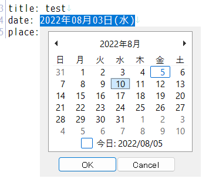

# カレンダーから日付を挿入
 

# 概要
* カレンダーで日付入力する系のマクロです。
	+ カーソル位置にカレンダーを出て、そこから日付を選択する感じです。
* 動作は状況によります。
	+ 文字列を選択していたらその部分を日付と解釈してそれを変更
	+ カーソル行に日付っぽい文字列があったらその部分の変更
	+ なければカーソル位置に新たに挿入
* カレンダーコントロールはWindowsのものそのままです。
	+ Windowsのバージョンによって違うかもしれませんが、けっこう豪華です。
	+ 方向キー、PageUp、PageDown、Home、Endなどのキー操作に対応しているみたいです。
	+ 月ビュー以外にも、年ビュー、10年ビュー、100年ビューにも切り替えらて面白いですが、これについては便利かどうかは微妙です。
* カレンダーコントロールは、AutoHotkeyで作成したツールで出しています。
	+ AutoHotkeyがなんだかわからなくても使えるようにしてあります。
	+ わかると色々できるようにもしてあります。
* 日付の形式は、「2022年08月05日」的なものがデフォルトですが、ある程度設定可能です。
	+ 「2022-08-05」とか「2022/08/05」とか
* 秀丸エディタv9.18β以降を利用の場合は、もう少し柔軟に設定可能です。
	+ 曜日を入れたりできます。

# インストール
* 展開したアーカイブを、適当なディレクトリにおいて、マクロ登録するだけです。
* 以下の2種類のマクロがあります。利用に適した方を登録してください

|マクロファイル名       |内容     |
|:----------------------|:--------|
|*insert_date.mac*      |通常版   |
|*insert_date_plus.mac* |高機能版 |

* 高機能版は次のような特徴があります
	+ 秀丸エディタv9.18β以降が必要、秀丸エディタの新機能 *js{...}* を使っているため
	+ 書式設定が少し柔軟で、曜日も入れられる
	+ 改造しやすい（たぶん）

# 設定
* 設定変更は、マクロ本体の冒頭の部分を編集により行います。
	+ 設定しやすいようにコメントなどを入れてあります。
* 年は4桁、月と日は2桁の数値で固定です。

## 正規表現パターン
* 変数 *$reg_date*
* 日付文字列を検索するための正規表現パターンです。
* 利用ケースにあったパターンに変更できます。
	+ なるべく取りこぼさないようにするのか、厳密にするのか、1900年代でもマッチするようにするのか、など

## 日付の書式
* 変数 *$sep_y* など
* 出力する日付の形式です。
* コメント内にある書式をコピペすれば、「2022/08/05」とかのパターンに変更できます。
* 上述の正規表現パターンと合うようにしておくとよいでしょう。

## AutoHotkeyの実行文
* 変数 *$ahk_path*
* AutoHotkeyがインストールされていない環境でも利用できるように設定してあります。
	+ 付属の *insert_date.exe* は、単純にAutoHotkeyで *insert_date.ahk* を exe化したものです。
* AutoHotkeyがインストールされているなら、.ahkファイルを実行する設定にするべきです。
	+ .ahkのほうが、立ち上がりが高速です。
	+ 見た目とか、機能とか、簡単に改造できます。

## *insert_date_plus.mac*
* こちらのマクロは高機能版で、曜日が入れられるなどの機能があります。
* 日付の書式はテンプレート方式で指定します。
* 下記のパターンを含む文字列をテンプレートとして、変数 *$date_template* に代入します。
* 上述の正規表現パターンと合うようにしておくとよいでしょう。

|パターン |意味 |
|:--------|:----|
|%y%%%    |年   |
|%m       |月   |
|%d       |日   |
|%w       |曜日 |

# マクロの動作 （改造するための情報）
* まず秀丸マクロ側で、選択文字列やカーソル行内の検索などをして、日付初期値と入力位置を決めます。
* それをAutoHotkeyに投げて、その初期値に従ったカレンダーGUIを表示させます。
	+ AutoHotkeyへは、日付の初期値と、GUIを出すXY座標を投げます。
	+ AutoHotkey側で扱う日付データは8桁の数字（例、"20220805"）です。
* ユーザーが選んだ日付を、AutoHotkeyから秀丸エディタに、prefix文字列を付けて新しい日付が返されます。
	+ 秀丸エディタ側では、受け取った日付を直接変数に入れられないため、結果を挿入させて、それを再度検索して抽出するためです。
	+ AutoHotkey側でキャンセルされた場合も、選択文字列は削除されてしまうので、その場合はUndoで削除を取り消します。
* その後、設定に従い日付文字列の整形作業を行います。

# 使用について
* 複製、改造、再配布に制限はありません。
* 無保証です。
